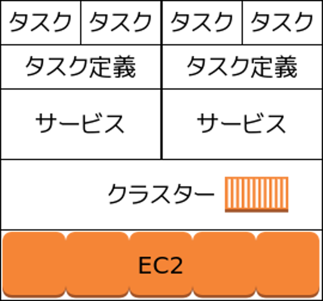

# Amazon ECS

---

## 内容
Amazon ECSを本番投入した話

- Scala Web Application

---

## 概要
DockerコンテナをEC2で動かす仕組み

- デプロイ・スケールが自動
- マシン設定はdockerfileで楽々
- docker imageを作れば準備完了

---

## Amazon ECR
- imageリポジトリ
- DockerHubのAmazon版
- DockerHub(非公開は有料)より安い

---

## ECSの仕組み

---

### クラスター
- EC2インスタンスが複数台所属
- サービスを複数動かせる

### サービス
- 1つのタスク定義を持つ
- 複数のタスクを起動する

### タスク
- 動作しているコンテナ

### タスク定義
- タスクに必要な諸々の設定

---

## サービス
- 1つのタスク定義を持つ
- デプロイ設定を持つ

デプロイ設定に基づきタスク定義に従いタスク生成

---

## デプロイ設定
### 必要数
デプロイするタスクの数。例えば2

### 最小ヘルス率
許容される最小率。50%にした場合、デプロイ時にタスクが1に減ることがある

### 最大率
許容される最大率。200%にした場合、デプロイ時に新旧合わせてタスクを4まで増やす

---

### よくあるミス
- 必要数1、最小100%、最大200%
- EC2が1台
- ポート都合でタスクが増やせない
- 最小100%なので先に古いのを落とせない

デプロイが永遠に終わらない。

---

### ItandiAccounts
- 必要数2、最小50%、最大200%
- EC2が2台
- タスクは2まで

#### デプロイの流れ
1. 古を1つ落とす
1. 新を1つ起動する
1. 古全部落とす
1. 新2つ目を起動する

---

## タスク定義
主にやること

- image設定
- ネットワーク
- ハードウェアリソース制限
- ログ設定
- 環境変数

---

### リビジョン
- タスク定義はバージョン管理される
- サービス更新でリビジョン変更するとデプロイ
